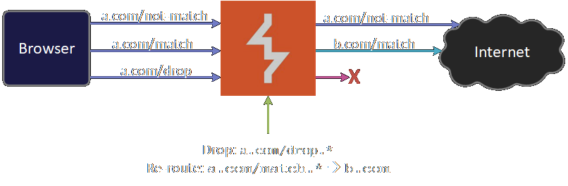

# Burp Suite Extension - Advanced Proxy

A Burp Suite Extension that drops/redirects requests from proxy by regex matching hostname, path, and method.

### Example

In the above example, `a.com/match.*` is configured to be routed to `b.com`. Any request that matches the regex will be routed to `b.com`. Note that the `Host` header of the request is not modified. Adv-proxy only changes the target protocol (`http`/`https`), the IP address (and the SNI), and the port number. These changes lies in the network and transport layer. The application layer (HTTP) of the request remains unchanged. 

`a.com/drop.*` is configued to be dropped. So, requests that match this regex will not go out from Burp Suite.

### Example Use Case
Let's say you are reverse engineering a minified JavaScript. It becomes handy if you can modify the code during this reversing process. This is how Advanced Proxy can help you:

1. Make a copy of the minified file in your local.
2. Setup a webserver to serve the file.
3. Create an Advanced Proxy rule and re-route the request for the JS file to your server.
4. Now you have full control of the file you are reversing.

### Instructions to Use
1. Obtain the Jar file of the extension from the releases page.
2. Go to the Extender tab in Burp Suite and add the extension like any other extension.
3. Go to the AdvProxy tab in Burp Suite and add and enable rules.
4. The AdvProxy tab is very much self-descriptive.

